# 🐦 Twitter Clone - Frontend Web


Interface web completa desenvolvida com React e TypeScript para uma rede social inspirada no Twitter, com responsividade mobile-first, gerenciamento de estado global e integração completa com a API REST.

---

## 🚀 Tecnologias

- **React 19**
- **TypeScript 5.x**
- **Vite 7.x** (build tool)
- **Redux Toolkit + RTK Query** (estado global e data fetching)
- **Styled Components** (estilização com temas)
- **React Router v7** (navegação)
- **@floating-ui/react** (posicionamento de popovers)
- **emoji-picker-react** (seletor de emojis)
- **@giphy/react-components** (seletor de GIFs)
- **react-datepicker + date-fns** (agendamento de posts)
- **react-infinite-scroll-component** (infinite scroll)
- **lucide-react** (ícones)
- **ESLint + Prettier** (qualidade de código)
- **Vercel** (deploy em produção)

---

## 📋 Funcionalidades

### Core Features
- ✅ Autenticação completa (registro, login, logout)
- ✅ Login com username, email ou telefone
- ✅ Feed "Para você" e "Seguindo"
- ✅ Criar, editar e deletar posts
- ✅ Curtidas com persistência de estado e optimistic updates
- ✅ Sistema de seguir/seguidores com sincronização automática
- ✅ Perfil de usuário completo com edição de avatar, banner e dados

### Social Features
- ✅ **Retweets e Quote Retweets** — retweet simples e com comentário
- ✅ **Replies** — threads de conversação com post pai expandido
- ✅ **Múltiplas Mídias** — até 4 arquivos por post (imagens e GIFs via Giphy)
- ✅ **Emojis** — seletor integrado com tema automático e busca por palavra-chave
- ✅ **Hashtags** — clicáveis, indexadas e com página de trending
- ✅ **Notificações** — likes, retweets, replies, follows e menções com badge e polling automático a cada 30s
- ✅ **Busca Global** — posts, usuários e hashtags com histórico persistido em localStorage
- ✅ **Infinite Scroll** — feed principal e comentários com pull to refresh
- ✅ **AvatarProfilePopover** — card de perfil interativo ao passar o mouse sobre avatares

### UI/UX
- ✅ **Responsividade completa** — mobile, tablet e desktop (mobile-first)
- ✅ **3 temas** — light, dark e dim (azulado) com persistência em localStorage
- ✅ **Fonte Chirp** — tipografia original do Twitter com preload otimizado
- ✅ **Header dinâmico** — oculta ao rolar para baixo no mobile, sticky no desktop
- ✅ **Navegação mobile** — footer fixo, FAB flutuante e drawer deslizante
- ✅ **Skeleton loading** — em todos os estados de carregamento
- ✅ **Toasts** — feedback visual para todas as ações

### Configurações
- ✅ **Aparência** — seleção de tema
- ✅ **Sua Conta** — edição de email, telefone e username com confirmação de senha
- ✅ **Segurança** — alteração de senha com validações client-side

### Features com Flag (preparadas, não ativadas)
- ⏸️ **Posts Agendados** — componente completo, infraestrutura Redis/Celery necessária
- ⏸️ **Enquetes** — componente completo pronto para ativação
- ⏸️ **Geolocalização** — componente completo pronto para ativação

---

## 🖼️ Screenshots

### Desktop
| Home | Explore | Profile |
|---|---|---|
| 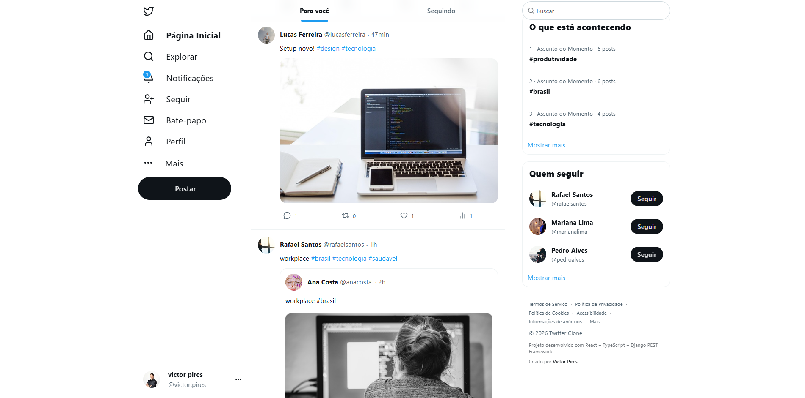 | 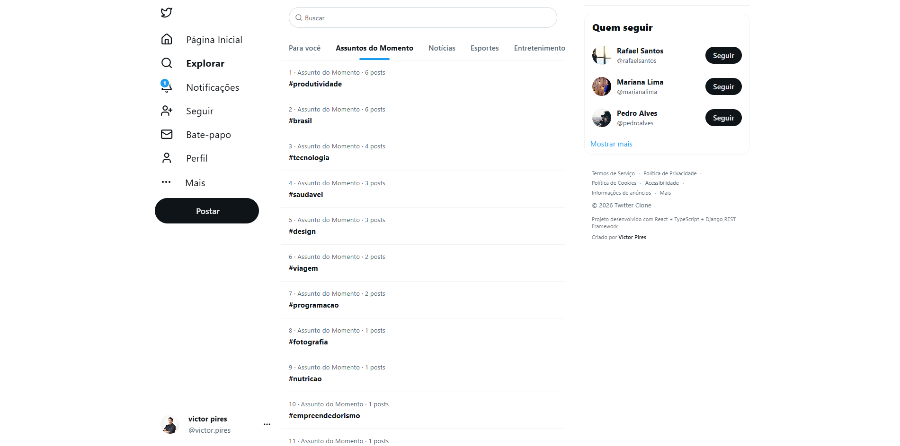 | 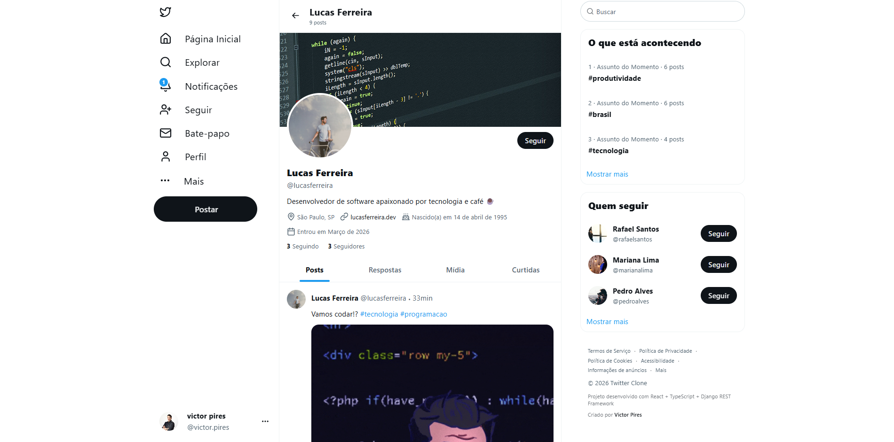 |

| PostDetail | Notifications | Settings |
|---|---|---|
| 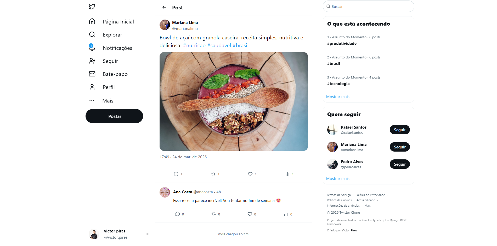 | 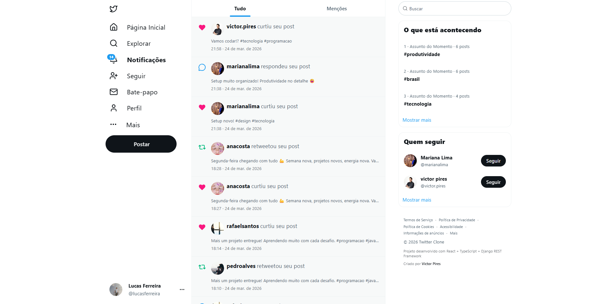 | 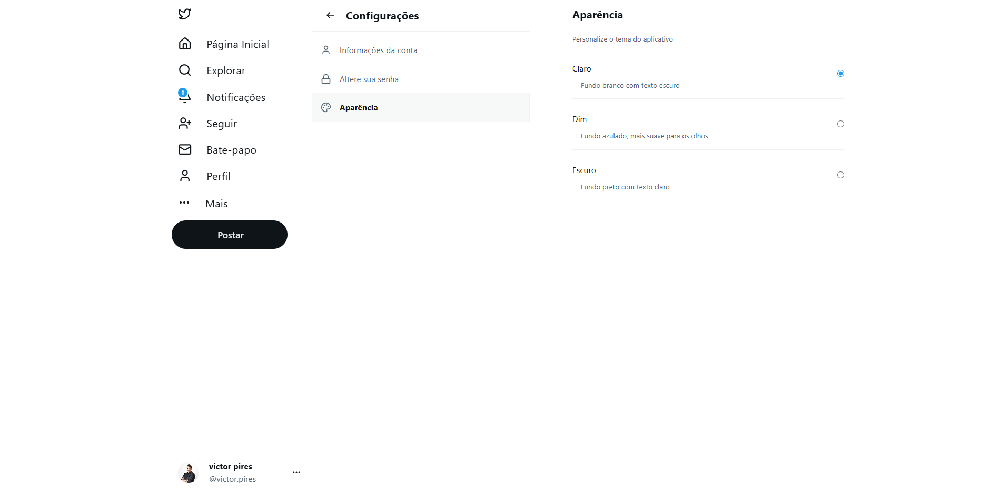 |

### Mobile
| Login | Home | Explore |
|---|---|---|
| 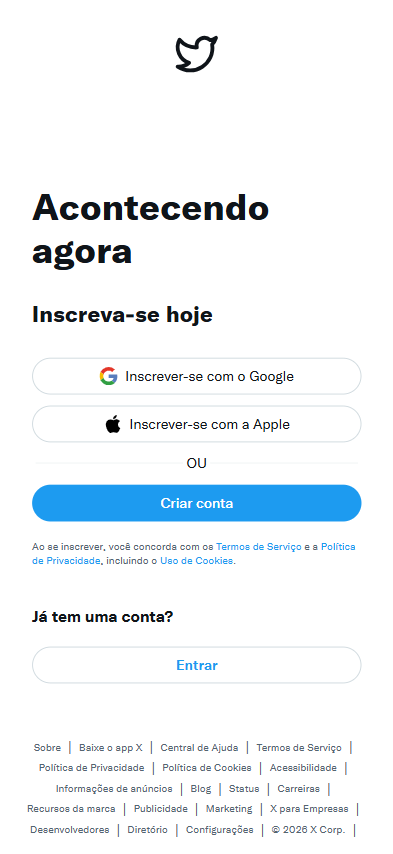 |  | 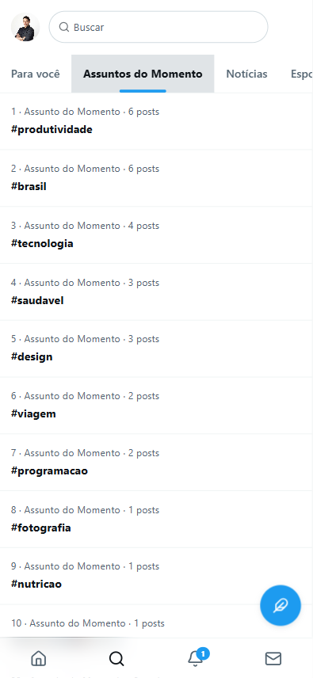 |

| Profile | Notifications | Settings |
|---|---|---|
| 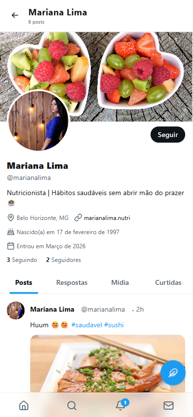 | 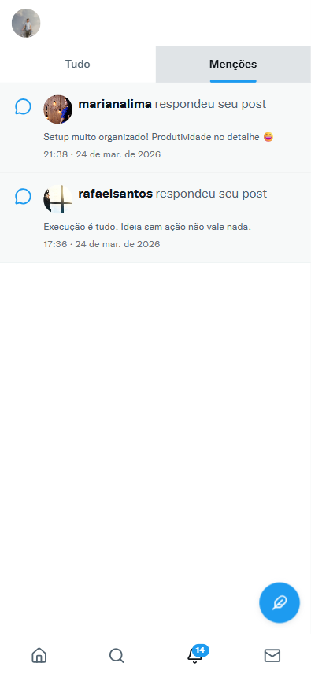 | 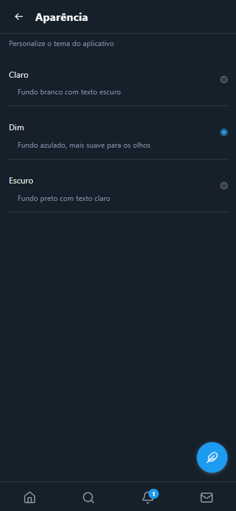 |

---

## 📂 Estrutura do Projeto

```
src/
├── components/
│   ├── common/                 # Componentes reutilizáveis
│   │   ├── Avatar/             # Avatar com ProfilePopover
│   │   ├── Button/             # Botão com variantes e loading
│   │   ├── Forms/              # PostForm, FormActions, MediaActions
│   │   │   └── FormActions/
│   │   │       └── components/
│   │   │           ├── EmojiPicker/
│   │   │           ├── GifPicker/
│   │   │           ├── LocationPicker/
│   │   │           ├── PollCreator/
│   │   │           └── PostScheduler/
│   │   ├── Modals/             # BaseModal, CommentModal, RetweetModal
│   │   ├── PageHeader/         # Header unificado para todas as páginas
│   │   ├── Popovers/           # BasePopover, RetweetPopover
│   │   ├── Posts/              # PostCard, PostList, PostCardActions
│   │   ├── SearchBar/          # Busca global com popover e histórico
│   │   ├── Skeleton/           # Loading states por componente
│   │   ├── Tabs/               # Tabs genéricas com scroll horizontal
│   │   └── Toast/
│   └── layout/                 # Componentes de estrutura
│       ├── InfoBar/            # Sidebar direita com widgets
│       ├── MainLayout/         # Layout principal com outlets
│       ├── MobileDrawer/       # Drawer de navegação mobile
│       ├── MobileFooter/       # Footer fixo mobile
│       ├── MobileFab/          # Botão flutuante mobile
│       ├── PageHeader/         # Header de página com variantes
│       └── SideBar/            # Sidebar desktop colapsável
├── contexts/                   # ThemeContext, MobileDrawerContext
├── hooks/                      # Hooks customizados
│   ├── usePosts.ts             # Feed, infinite scroll, paginação
│   ├── usePostActions.ts       # Like, retweet, delete, bookmark
│   ├── useFormModal.ts         # Estado centralizado de formulários
│   ├── useCreatePost.ts        # Criação, edição e quote de posts
│   ├── useHashtags.ts          # Hashtags (all/trending/search)
│   ├── useHashtagPosts.ts      # Posts por hashtag
│   ├── useUserActions.ts       # Follow/unfollow com optimistic updates
│   ├── useViewingUser.ts       # Usuário sendo visualizado
│   ├── useScrollDirection.ts   # Direção do scroll para header dinâmico
│   └── useRenderHashtags.ts    # Renderização de hashtags clicáveis
├── pages/                      # Páginas da aplicação
│   ├── Home/
│   ├── Explore/
│   ├── Notifications/
│   ├── Connect/
│   ├── Messages/
│   ├── Profile/
│   ├── PostDetail/
│   ├── FollowPage/
│   ├── Settings/
│   └── Login/
├── routes/                     # Configuração de rotas com lazy load
├── store/                      # Redux store
│   └── slices/
│       ├── api/                # RTK Query endpoints por domínio
│       │   ├── auth.api.ts
│       │   ├── users.api.ts
│       │   ├── posts/          # posts, replies, retweets, likes...
│       │   └── hashtags.api.ts
│       ├── auth/               # authSlice
│       └── posts/              # postsSlice, usersSlice
├── styles/                     # globalStyles, themes, feedStyles
├── types/                      # Tipos de domínio e contratos de API
│   ├── domain/                 # models, requests, responses
│   └── contracts/              # DTOs do backend, shared
└── utils/                      # Utilitários
    ├── transformers/           # snake_case → camelCase, normalização
    ├── formatDate.ts
    └── formatNumber.ts
```

---

## 💻 Como rodar localmente

### Pré-requisitos
- Node.js 18+
- npm ou yarn
- API rodando em produção ou localmente (ver [twitter-clone-api](https://github.com/victorpiressk/twitter-clone-api))

### 1. Fork do repositório

Clique no botão **Fork** no GitHub para criar uma cópia do repositório na sua conta.

### 2. Clone o seu fork
```bash
git clone https://github.com/<seu-usuario>/twitter-clone-web.git
cd twitter-clone-web
```

### 3. Instale as dependências
```bash
npm install
```

### 4. Configure a URL da API

Abra o arquivo `src/store/slices/api/base.api.ts` e altere o `baseUrl` para a URL da sua API:
```typescript
baseQuery: fetchBaseQuery({
  baseUrl: 'https://sua-api.com', // substitua pela URL da sua API
  ...
})
```

### 5. Inicie o servidor de desenvolvimento
```bash
npm run dev
```

**A aplicação estará disponível em:** `http://localhost:5173`

---

## 📜 Scripts Disponíveis

```bash
npm run dev        # Servidor de desenvolvimento
npm run build      # Compilação TypeScript + build de produção
npm run preview    # Preview do build de produção
npm run lint       # Verificar erros de lint
npm run lint:fix   # Corrigir erros de lint automaticamente
npm run format     # Formatar código com Prettier
```

---

## 🏗️ Arquitetura

### Gerenciamento de Estado

O estado global é gerenciado com **Redux Toolkit**, dividido em três slices:

- **`authSlice`** — autenticação, token e usuário logado com persistência em localStorage
- **`postsSlice`** — cache normalizado de posts (`byId`/`allIds`), feeds com paginação e post detail
- **`usersSlice`** — cache de usuários, follow state separado para performance, sugestões e perfil sendo visualizado

O **RTK Query** cuida de todo o data fetching, cache automático e invalidação via tags. Os endpoints estão organizados por domínio em `store/slices/api/` e cobrem os 49 endpoints da API.

### Data Flow

```
API (Django) → RTK Query → Transformers → Redux Store → Selectors → Components
```

Os dados do backend passam por **transformers** (`utils/transformers/`) que convertem `snake_case` → `camelCase` e normalizam os tipos antes de entrar no Redux. Essa camada de adaptação isola o frontend de mudanças no contrato da API.

### Padrões Arquiteturais

**Normalized State** — posts e usuários são armazenados em `byId` + `allIds`, garantindo que cada entidade exista em um único lugar e atualizações se propaguem automaticamente por toda a aplicação.

**Optimistic Updates** — likes, retweets e follows atualizam a UI instantaneamente enquanto a API processa em background. Em caso de erro, o estado é revertido automaticamente.

**Transformers Pattern** — camada de adaptação entre os contratos do backend (snake_case) e os modelos do frontend (camelCase). Facilita mudanças na API sem impactar componentes.

**Feature Flags** — Posts agendados, enquetes e geolocalização estão implementados com flag `FEATURE_ENABLED = false`. O código está pronto para ativação sem reescrita.

**Context Pattern** — `ThemeContext` e `MobileDrawerContext` são separados dos seus hooks (`useTheme`, `useMobileDrawer`) para compatibilidade com Fast Refresh do Vite.

**Backend como Source of Truth** — validação de mídia e regras de negócio são responsabilidade do backend. O frontend valida apenas para UX básica, evitando duplicação de lógica.

### Code Splitting

O bundle de produção é dividido em chunks por responsabilidade, com lazy load em todas as rotas via `React.lazy` + `Suspense`:

| Chunk | Conteúdo | Tamanho (gzip) |
|---|---|---|
| `vendor-react` | react, react-dom, react-router | 17 KB |
| `vendor-redux` | @reduxjs/toolkit, react-redux | 12 KB |
| `vendor-styled` | styled-components | 15 KB |
| `vendor-ui` | lucide-react, infinite-scroll | 6 KB |
| `vendor-floating` | @floating-ui/react | 10 KB |
| `vendor-emoji` | emoji-picker-react | 75 KB |
| `vendor-datepicker` | react-datepicker, date-fns | 37 KB |
| `vendor-giphy` | @giphy/js-fetch-api | 22 KB |
| Chunk principal | Código da aplicação | 99 KB |

---

## 🚀 Deploy em Produção (Vercel)

O deploy é feito automaticamente ao fazer push na branch `main`.

### Configuração Manual

1. Importe o repositório no [Vercel](https://vercel.com)
2. Antes de fazer o deploy, atualize o `baseUrl` em `src/store/slices/api/base.api.ts` com a URL da sua API em produção
3. O Vercel detecta automaticamente o Vite e configura o build

**Build Command:** `npm run build`  
**Output Directory:** `dist`

---

## 🔗 Links

- **Frontend em produção:** [twitter-clone-web-eight.vercel.app](https://twitter-clone-web-eight.vercel.app/)
- **Repositório da API:** [github.com/victorpiressk/twitter-clone-api](https://github.com/victorpiressk/twitter-clone-api)
- **API Endpoints:** [API_ENDPOINTS.md](https://github.com/victorpiressk/twitter-clone-api/blob/main/API_ENDPOINTS.md)

---

## 📊 Estatísticas do Projeto

- **Versões lançadas:** 13 (0.0.1 → 0.3.0)
- **Componentes:** 70+
- **Hooks customizados:** 15+
- **Endpoints integrados:** 49
- **Bundle principal:** 328 KB (↓71% após otimizações)
- **Lighthouse Performance:** 79
- **Lighthouse Best Practices:** 100

---

## 🗺️ Roadmap

- [ ] Ativar Posts Agendados (requer Redis/Celery no plano pago do Render)
- [ ] Ativar Enquetes
- [ ] Ativar Geolocalização
- [ ] Mensagens diretas
- [ ] PWA (Progressive Web App)
- [ ] Testes automatizados (Vitest + Testing Library)

---

## 🎓 Projeto Educacional & Portfólio

Desenvolvido como projeto final de curso e portfólio frontend profissional demonstrando: React avançado, Redux Toolkit, RTK Query, responsividade mobile-first, code splitting, performance e boas práticas de código.

---

## 👨‍💻 Autor

**Victor Pires** — [@victorpiressk](https://github.com/victorpiressk) — [LinkedIn](https://www.linkedin.com/in/victor-p-rego/)

---

**Versão:** 0.3.0  
**Última atualização:** 21/03/2026  
**Status:** ✅ Em Produção
